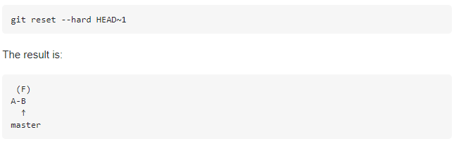
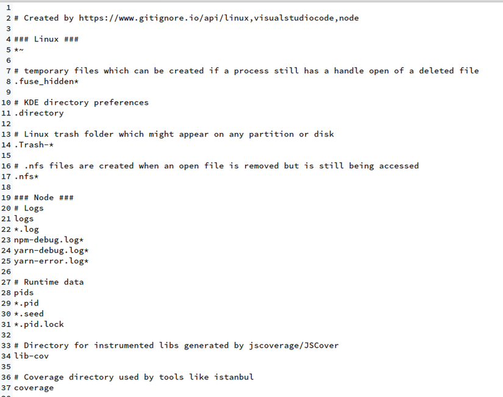

- [Lifecycle of the Status](#lifecycle-of-the-status)
  - [1. The lifecycle of the status of your file](#1-the-lifecycle-of-the-status-of-your-file)
  - [2. `git status`](#2-git-status)
  - [3. `git add`](#3-git-add)
  - [4. `git reset` or `git restore` to unstage file](#4-git-reset-or-git-restore-to-unstage-file)
  - [5. `.gitignore` file](#5-gitignore-file)
  - [6. `git commit`](#6-git-commit)
  - [7. `git reset` or `git restore` to uncommit](#7-git-reset-or-git-restore-to-uncommit)
  - [8. `git stash`](#8-git-stash)

# Lifecycle of the Status

## 1. The lifecycle of the status of your file

## 2. `git status`

Tác dụng: Để check trạng thái của những file bạn đã thay đổi trong thư mục làm việc. VD: Tất cả các thay đổi cuối cùng từ lần commit cuối cùng.

Cách dùng: git status trong thư mục làm việc.

## 3. `git add`

Tác dụng: Thêm thay đổi đến stage/index trong thư mục làm việc.

Cách dùng: git add

## 4. `git reset` or `git restore` to unstage file

Tác dụng: Bạn đã đưa một tập tin nào đó vào Staging Area nhưng bây giờ bạn muốn loại bỏ nó ra khỏi đây để không phải bị commit theo.

Cách dùng: git reset HEAD tên_file

## 5. `.gitignore` file

Tác dụng : Liệt kê những file mà mình không mong muốn cho vào git hoặc hiểu nôm na là Git sẽ bỏ qua những file đó đi.

## 6. `git commit`

Tác dụng: Mỗi lần commit nó sẽ được lưu lại lịch sử chỉnh sửa của code kèm theo tên và địa chỉ email của người commit. Ngoài ra trong Git bạn cũng có thể khôi phục lại tập tin trong lịch sử commit của nó để chia cho một branch khác, vì vậy bạn sẽ dễ dàng khôi phục lại các thay đổi trước đó.

Cách dùng: git commit -m ”Đây là message, bạn dùng để note những thay đổi để sau này dễ dò lại”

- `git commit --amend`

## 7. `git reset` or `git restore` to uncommit

Tác dụng: Trong quá trình làm việc với GIT, chúng ta có thể thực hiện commit file hoặc source code không mong muốn. Vì vậy để hủy bỏ commit này, các bạn sử dụng những cách sau đấy.
Cách dùng :git reset HEAD~<number_commit>

## 8. `git stash`

Tác dụng: Lưu thay đổi mà bạn không muốn commit ngay lập tức.

Cách dùng: git stash trong thư mục làm việc của bạn.
