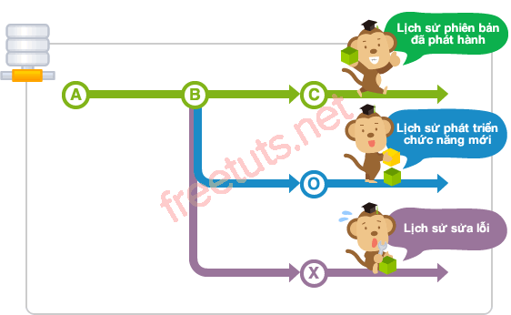
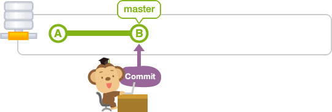
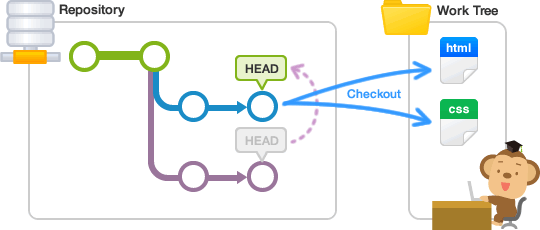

## 1. Branch là gì?

Đối với những dự án có nhiều thành viên tham gia thì mỗi thành viên sẽ nhận được rất nhiều task từ leader, vì vậy việc xử lý các task này trên cùng một thời gian là rất khó vì dễ bị đụng code.

Để giải quyết vấn đề này thì chúng ta sẽ sử dụng branch của Git, tương ứng với mỗi nhiệm vụ chúng ta sẽ tạo một branch và làm việc trên đó, các branch này sẽ hoạt động riêng lẻ và không ảnh hưởng lẫn nhau.

Vậy branch là những phân nhánh ghi lại luồng thay đổi của lịch sử, các hoạt động trên mỗi branch sẽ không ảnh hưởng lên các branch khác nên có thể tiến hành nhiều thay đổi đồng thời trên một repository, giúp giải quyết được nhiều nhiệm vụ cùng lúc.

# Cú pháp tạo nhánh trong git: git branch <tên nhánh>

# Cú pháp xóa nhánh trong git: git branch -D <tên nhánh>

## 2. Branch master

Khi bạn tạo một repository thì Git sẽ thiết lập branch mặc định là master, nghĩa là nó sẽ tự tạo một branch master và mọi hoạt động của ban lúc này đều nằm trên branch master. Chúng ta cũng có thể xem đây là branch mặc định đóng vai trò cập nhật dữ liệu và đồng bộ với remote repository.

Giả sử bạn đang có 10 tasks, lúc này bạn không nên làm việc trực tiếp trên branch master mà hãy tạo ra nhưng branch khác và branch master chỉ nên dùng để pull code từ remote branch master và merge với các branch còn lại. Mỗi branch làm việc sẽ được ghi lại lịch sử nên trong quá trình làm việc bạn hoàn toàn có thể rollback lại quá khứ dựa vào chỉ mục index mà Git đã lưu.

## 3.Chuyển đổi branch

Để chuyển đổi branch làm việc thì sẽ thực hiện thao tác gọi là checkout. Khi thực hiện checkout, trước tiên nội dung của lần commit cuối cùng trong branch chuyển đến sẽ được mở ra trong work tree. Và commit đã tiến hành sau khi check out thì sẽ được thêm vào branch sau khi di chuyển đến.

Cú pháp :Checkout branch sẽ thực hiện bằng lệnh checkout.

$ git checkout <branch>
Sẽ checkout branch issue1.

$ git checkout issue1
Switched to branch 'issue1'

**HEAD**
HEAD là tên hiển thị phần đầu của branch đang sử dụng hiện tại. Mặc định là đang hiển thị phần đầu của master. Bằng việc di chuyển HEAD thì branch đang sử dụng sẽ được thay đổi.

**STASH**
Stash là khu vực ghi lại tạm thời nội dung thay đổi của file. Bằng việc sử dụng stash, trong work tree và index, những thay đổi chưa được commit có thể lưu lại tạm thời.
